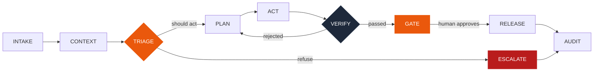
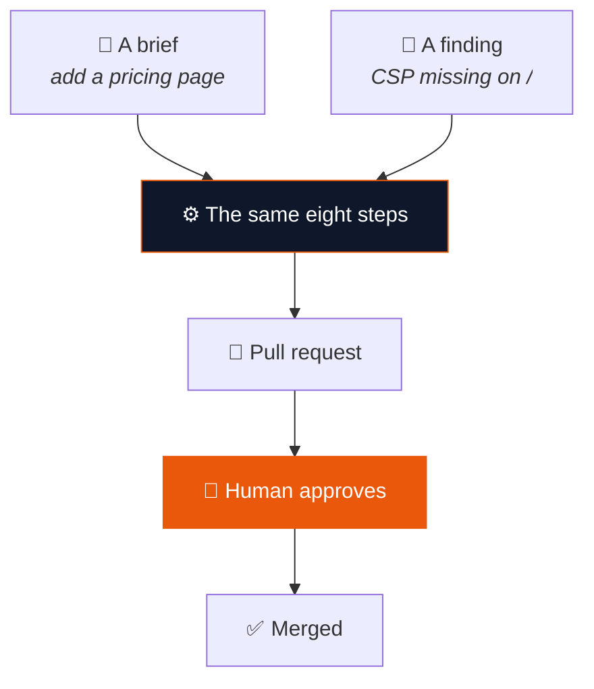
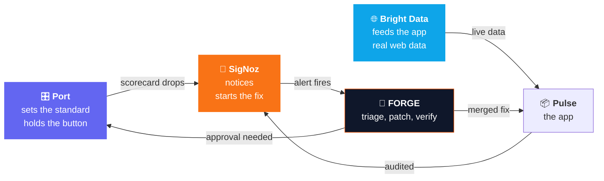

<div align="center">

# 🔨 FORGE

### The software factory that checks its own work

*It builds a page. Then every few minutes it goes back, finds the security holes it left behind, and fixes them — with a human on the button.*

<br>


**Zero Downtime Hackathon** · Bright Data Loft, San Francisco · 22 August 2026

</div>

---

## 🎯 The problem

Ask any AI for a quick web page and you get one in seconds. You also get a page with **no security headers**, an **admin route left wide open**, and an **API key sitting in a comment**.

The gap isn't writing code. It's everything that happens after.

| | |
|---|---|
| 🚢 **Shipped and forgotten** | The tool writes the code and walks away. Nothing goes back to check it a week later. |
| 📋 **Nobody reads the scan** | Security scanners find problems and file tickets. Tickets sit in a backlog. |
| ⚠️ **Fixing blind is worse** | Tools that auto-fix everything they see will happily patch an app that is simply offline. |

---

## 💡 What FORGE does

The hackathon asked: *can you build the factory that builds the app?*

We built one whose relationship with the app **doesn't end at shipping**.

<div align="center">

| | | |
|:---:|:---|:---|
| **1** | **Looks** | Checks every page for 17 problems — missing security headers, open admin routes, leaked keys, images with no alt text |
| **2** | **Thinks** | Decides what kind of problem it is, and whether touching it is even safe |
| **3** | **Writes** | Writes the actual code fix, and a test to go with it |
| **4** | **Proves** | Runs the tests, then re-checks the page. The hole has to be gone |
| **5** | **Asks** | Opens a pull request with the evidence. A person approves. Then it merges |

</div>

> **The key design decision:** building a feature and fixing a defect are the **same code path**. Plan a change, write files, run tests, verify, ask a human, commit. A brief and a finding are just two things that arrive at the same front door.

---

## 🔄 The loop



Two intakes, one engine:



---

## 🛑 The part we're proudest of

**It knows when *not* to fix things.**

A system that fixes everything it sees is dangerous. So before writing a single line, FORGE classifies the finding:

<div align="center">

| Verdict | Meaning | Action |
|:---|:---|:---:|
| 🟢 **AUTOFIX_SAFE** | Contained, well understood | ✅ **Fix** |
| 🟠 **NEEDS_HUMAN_DESIGN** | Real problem, but changing it could break something we can't see | ⛔ **Stop** |
| 🔵 **FALSE_POSITIVE** | The check fired but it's wrong here — and it writes down *why* | ⛔ **Stop** |
| 🔴 **UPSTREAM_OUTAGE** | Every check failed because nothing was there | ⛔ **Stop** |
| ⚪ **DUPLICATE** | Same root cause as a fix already in flight | ⛔ **Attach** |

</div>

> **Three of the five answers are "do nothing." That is the feature.**

The hardest case is the last one. `EXTRACTION_COLLAPSE` and `UPSTREAM_OUTAGE` look *identical* in the metrics — both are total failure across every check. The only way to tell them apart is to read the page. A naive system files 37 fix requests against an app that's simply offline.

---

## 🔍 The audit — 17 checks, every few minutes

<table>
<tr><td valign="top" width="50%">

**🔒 Security**

| | Check | Sev |
|:--|:--|:--|
| `S1` | Content-Security-Policy | 🔴 |
| `S2` | X-Frame-Options | 🔴 |
| `S3` | Strict-Transport-Security | 🟠 |
| `S4` | X-Content-Type-Options | 🟠 |
| `S5` | Referrer-Policy | ⚪ |
| `S6` | Server header not leaking | 🟠 |
| `S7` | Cookie flags | 🔴 |
| `S8` | CORS not wildcard | 🔴 |
| `S9` | `.env` `/admin` `/debug` unreachable | 🔴 |
| `S10` | No secrets in HTML/JS | 🔴 |
| `S11` | No stack traces leaked | 🔴 |
| `S12` | Docs endpoint guarded | 🟠 |

</td><td valign="top" width="50%">

**♿ Quality & performance**

| | Check | Sev |
|:--|:--|:--|
| `Q1` | Images have alt text | 🟠 |
| `Q2` | External links `rel=noopener` | 🟠 |
| `Q3` | Title + meta description | ⚪ |
| `Q4` | No broken internal links | 🟠 |
| `P1` | Response time under 500ms | 🟠 |

<br>

**📊 Grades**

| | Rule |
|:--|:--|
| 🥇 **Gold** | Zero HIGH, zero MED |
| 🥈 **Silver** | Zero HIGH |
| 🥉 **Bronze** | One or more HIGH |

</td></tr>
</table>

**None of this is planted.** Ask any model to write a quick FastAPI page and it won't add security headers, it'll leave `/docs` open, and half the time it'll drop an example key in a comment. The factory writes code with exactly those flaws — then catches itself.

---

## 🧰 How the three tools hold each other up



| Tool | Its job | Why it's load-bearing |
|:---|:---|:---|
| 🎛️ **Port** | Stores what *good* means as a scorecard, keeps a record of every run, and holds the approve button | Nothing ships until a person clicks it there |
| 📡 **SigNoz** | Every audit, decision and patch is traced. Grades are metrics | The alert isn't a notification — **it's the trigger** that opens the fix run |
| 🌐 **Bright Data** | The app runs on live web data pulled through Scraper Studio, entirely from the terminal | We never opened the dashboard once |

> **Take any one away and the loop doesn't close.**

---

## ✅ Two checks, not one

An AI can easily write a patch that satisfies a test without actually closing the hole. So verification is **two independent checks**:

```
  1. The tests pass          →  proves the app still works
  2. A fresh audit passes    →  proves the hole is gone, and no new one opened
```

`findings_introduced > 0` is a **hard blocker**, not a warning. A patch that closes one hole and opens another is rejected before a human ever sees it.

**And it really does reject.** During the build it threw out patch after patch — three attempts each — because the fix didn't close the hole, then escalated to a human rather than shipping something it couldn't prove. That's the system working, not failing.

---

## 🛡️ Where it stops — and why

**FORGE does not deploy.** It opens a pull request, a person approves, and it merges. Your own pipeline ships it, exactly like any human's PR.

| | Guard rail |
|:---:|:---|
| 📁 | It can only write to `pulse/` and `tests/`. **It cannot change its own code.** Attempts are refused and logged |
| 🌿 | It never commits to `main`. Every change is a branch and a pull request |
| 🧪 | It cannot push a branch whose tests fail |
| 👤 | A human approves every merge, looking at the diff and the evidence |
| 🎯 | The audit only runs against **our own registered services**. The target list is a closed registry, not an open input |

> Deploying would mean handing an AI the keys to a live site. Nobody should grant that, and we wouldn't ask for it. Stopping at the pull request isn't a limitation — it's the design.

---

## 🏗️ Architecture

```
forge/
├── engine.py       ⚙️  the eight steps, both intakes, one path
├── audit.py        🔍  17 checks across every route
├── triage.py       🧠  five classifications, incl. decline-to-act
├── planner.py      ✍️  writes features and patches
├── verify.py       ✅  pytest + fresh audit, both must pass
├── vcs.py          🌿  branch → commit → PR → merge
├── scheduler.py    ⏱️  the recurring audit loop
├── brightdata.py   🌐  Scraper Studio CLI wrapper
├── portal.py       🎛️  Port entities, scorecards, approvals
├── telemetry.py    📡  OpenTelemetry → SigNoz
└── console/        🖥️  live operator view

pulse/              📦  the app the factory builds and audits
policy/             📋  audit_policy.yaml — the 17 checks
```

**Stack:** Python 3.14 · FastAPI · OpenTelemetry · SQLite · pytest

---

## 🚀 Running it

```bash
# 1. Install
python -m venv .venv && source .venv/bin/activate   # Windows: .venv\Scripts\Activate.ps1
pip install -r requirements.txt

# 2. Configure — see .env.example
cp .env.example .env

# 3. Start the factory and the app
python -m uvicorn forge.api:app  --port 8000 --reload
python -m uvicorn pulse.main:app --port 8100 --reload

# 4. Open the console
open http://localhost:8000/console
```

**Try it:**

```bash
curl -X POST localhost:8000/audit/run                 # audit every route now
curl localhost:8000/api/findings                      # what it found
curl -X POST localhost:8000/intake/brief \            # ask it to build something
     -H "Content-Type: application/json" \
     -d '{"description":"Add a pricing page with three tiers"}'
```

<details>
<summary><b>📡 API reference</b></summary>

<br>

| Method | Path | What it does |
|:---|:---|:---|
| `GET` | `/health` | Scheduler state, spend, telemetry, open findings |
| `POST` | `/audit/run` | Force an audit immediately |
| `GET` | `/api/findings` | The durable catalog — open, closed, suppressed |
| `GET` | `/api/runs` | Run history |
| `GET` | `/api/runs/current` | The run in flight, or an explicit `null` |
| `GET` | `/api/runs/{id}` | One run with its stages |
| `POST` | `/intake/brief` | Submit a change request |
| `POST` | `/intake/finding` | Findings from the scheduler or a SigNoz alert |
| `GET` | `/api/approvals` | Pending approvals |
| `POST` | `/api/approvals/{id}/{decision}` | Approve or reject |
| `POST` | `/port/approved` | Port approval webhook |

</details>

---

## 📉 Known limitations

We'd rather tell you than have you find them.

- **Detection latency.** SigNoz's alert manager groups webhooks on roughly a five-minute cycle, so real-world detection is slower than the demo suggests. The scheduler checks grades itself as a fast path — both paths enter the factory at the same door.
- **Patch quality.** Verification rejected most patches the agent wrote. It correctly refused to ship them, but it means patch generation isn't good enough yet. The fix is better file-layout context and treating header findings as a family rather than one at a time.
- **One agent, no critic.** A proposer/critic split would catch bad diagnoses before they cost a verify cycle.
- **Hand-written checks.** The 17 checks are ours, not derived from a published standard. Inferring them would make this scale.
- **Confidence isn't reported** by triage yet, so the console shows *not reported*.

---

## 🙏 Built with

<div align="center">

**[Port](https://port.io)** · **[Bright Data Scraper Studio](https://brightdata.com)** · **[SigNoz](https://signoz.io)**

Built in one day at the Zero Downtime Hackathon, hosted by [WeMakeDevs](https://wemakedevs.org) at the Bright Data Loft, San Francisco.

<br>

*A chatbot answers questions. An agent acts on them. A factory checks its own work.*

</div>
